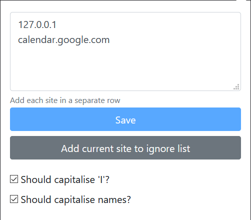

# What is this extension?

Firefox/Microsoft Edge Chromium add-on to automatically capitalise the first letter of a sentence while typing.

## Features

- Capitalise the first letter of a sentence.
- Capitalise `I`.
- Capitalise constants such as [days](src/constants.js#L1), [months](src/constants.js#L11)
- Capitalise common [abbreviations](src/constants.js#L24)

## Configuration

If you don't want the extension to auto-capitalise on a particular website, you can configure it in the settings window.

## Add-on download links

- [Firefox](https://addons.mozilla.org/en-US/firefox/addon/auto-capitalise-sentence/)
- [Microsoft Edge](https://microsoftedge.microsoft.com/addons/detail/auto-capitalise-sentence/ifebcbphlfoifeajpbecncpgjflpbann)

## Do you have issues?

Please feel free to raise issues [here](https://github.com/hrai/auto-capitalise-extension/issues)
