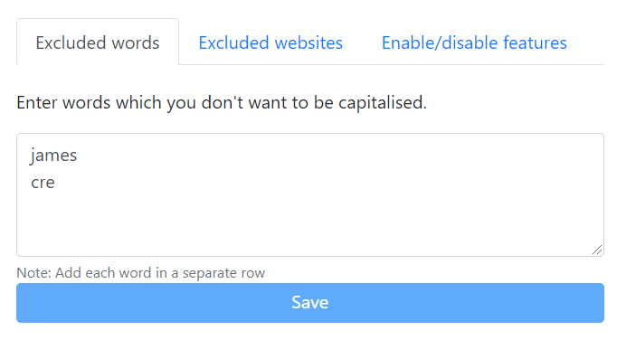
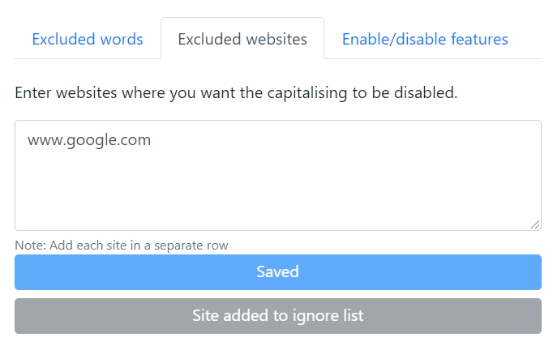
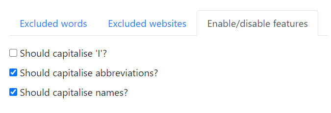

# What is this extension?

Firefox/Microsoft Edge Chromium add-on to automatically capitalise words while typing.

## Features

- Capitalise the first letter of a sentence.
- Capitalise the word `I`.
- Capitalise common [names](src/name-constants.js#L1)
- Capitalise common [abbreviations](src/abbreviation-constants.js#L1)
- Capitalise constants such as [days](src/constants.js#L4), [months](src/constants.js#L14)
- Add apostrophe to common [English words](src/constants.js#L27)

## Configuration/Settings

There are 3 sections to configure the extension.

- Excluded words: If you want to exclude words from being auto-capitalised, you can add the words in the textarea and save it.

  

- Excluded websites: If you don't want the words to be auto-capitalised, you can add the website's name in the textarea and save it.

  

- Enable/disable features: If you don't want any of the features provided by this extension, you can disable it here.

  

## Add-on download links

- [Firefox](https://addons.mozilla.org/en-US/firefox/addon/auto-capitalise-sentence/)
- [Microsoft Edge](https://microsoftedge.microsoft.com/addons/detail/auto-capitalise-sentence/ifebcbphlfoifeajpbecncpgjflpbann)

## Do you have issues?

Please feel free to raise issues [here](https://github.com/hrai/auto-capitalise-extension/issues)
