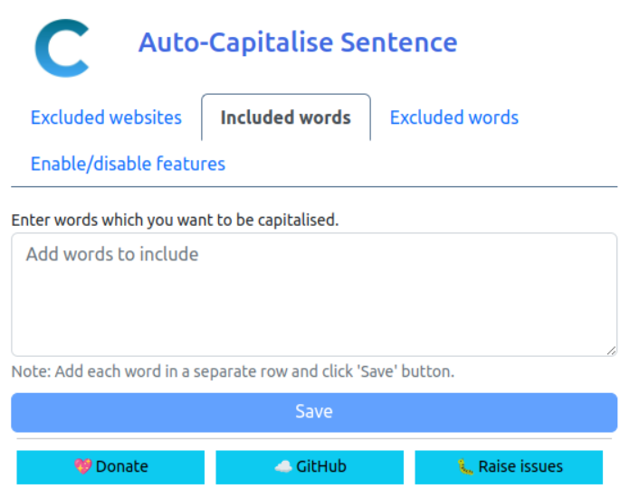

# What is this extension?

Firefox/Microsoft Edge Chromium add-on to automatically capitalise words while typing. Works with traditional input fields, textareas, and modern contenteditable elements used by chat applications like Discord, Slack, Teams, and Telegram Web.

**Note**: WhatsApp Web and Facebook Messenger are not supported due to technical limitations with their Lexical editor framework. See [compatibility section](#compatibility--known-limitations) below.

## Features

- Capitalise the first letter of a sentence.
- Capitalise the word `I`.
- Capitalise common [names](src/name-constants.js#L1)
- Capitalise common [locations/places](src/location-constants.js#L1)
- Capitalise common [abbreviations/acronyms](src/acronym-constants.js#L1)
- Capitalise constants such as [days](src/constants.js#L6), [months](src/constants.js#L16)
- Add apostrophe to common [English words](src/constants.js#L27)
- Capitalise custom words
- Optional Sentence Case mode (preserve internal word casing while capitalising sentence starts and standalone "I")
- Per-field debounced processing to reduce performance impact (configurable delay)
- Works with modern chat applications (Discord, Slack, Teams, Telegram Web, Google Chat)
- Supports contenteditable elements (`
`, ``, `
` tags with contenteditable attribute)
- **Not compatible with WhatsApp Web and Facebook Messenger** (see [Known Limitations](#compatibility--known-limitations))

## Configuration/Settings

There are 4 sections to configure the extension.

- Excluded websites: If you don't want the words to be auto-capitalised, you can add the website's name in the textarea and save it.

  

- Included words: If you want to capitalise some custom words, you can add them here.

  

- Excluded words: If you want to exclude words from being auto-capitalised, you can add the words in the textarea and save it.

  

- Enable/disable features: If you don't want any of the features provided by this extension, you can disable it here.

  

### Debounce Delay (New)

You can now configure how long the extension waits after your last keystroke before performing capitalisation. This helps avoid unnecessary work while you're still typing rapidly.

Defaults:

- Default delay: 5000 ms (5 seconds)
- Range: 0 – 60000 ms

Behaviour:

- Sliding window: each new keystroke resets the timer.
- Setting delay to 0 applies capitalisation immediately (no debouncing) – may reduce performance on very large editors.
- Each editable field gets its own independent timer.

Recommendations:

- 3000–5000 ms: Good balance for most users.
- 0–500 ms: Only if you prefer near-instant capitalisation and your pages are lightweight.
- >10000 ms: Use if you type in long uninterrupted bursts and want minimal interruptions.

To change it, open the extension popup settings and update the Debounce Delay (ms) field. The change applies immediately to all newly observed inputs.

## Add-on download links

- [Chrome](https://chrome.google.com/webstore/detail/auto-capitalise-sentence/ibihgblnfolhldgjbikghldfhkgknlpa?hl=en-GB)
- [Firefox](https://addons.mozilla.org/en-US/firefox/addon/auto-capitalise-sentence/)
- [Microsoft Edge](https://microsoftedge.microsoft.com/addons/detail/auto-capitalise-sentence/ifebcbphlfoifeajpbecncpgjflpbann)

## Compatibility & Known Limitations

### Supported Platforms

The extension works on most websites with:
- ✅ Traditional input fields and textareas

### Sponsor
- ✅ **Slack** - Full support
- ✅ **Microsoft Teams** - Full support
- ✅ **Telegram Web** - Full support
- ✅ **Google Chat** - Full support
- ✅ Most web-based text editors

- PRs are welcome! :)

The following sites are **not compatible** with this extension and are automatically excluded:

#### ❌ WhatsApp Web (`web.whatsapp.com`)
- **Reason**: Uses Meta's Lexical editor framework
- **Issue**: Lexical maintains strict internal state that breaks when external scripts modify the DOM
- **Impact**: Would cause complete input blocking (cannot type after certain characters)
- **Workaround**: Use WhatsApp Desktop app or mobile app for auto-capitalization

#### ❌ Facebook Messenger (`messenger.com`)
- **Reason**: Uses Meta's Lexical editor framework (same as WhatsApp)
- **Issue**: Same technical limitations as WhatsApp
- **Impact**: Would cause input freezing and dropped characters
- **Workaround**: Use Messenger Desktop app or mobile app

#### ❌ AWS Console (`aws.amazon.com`)
- **Reason**: Code editors conflict with auto-capitalization
- **Impact**: Would capitalize code/configuration inappropriately

### Technical Details

WhatsApp and Messenger use **Lexical**, Facebook's modern rich-text editor framework. Lexical maintains its own internal representation of the editor state, separate from the DOM. Any external modification to the DOM—even changing text content without touching the HTML structure—desynchronizes Lexical's internal state from the DOM, causing:

- Input blocking (cannot type after certain words)
- Cursor position issues
- Dropped characters
- Event handling conflicts

### Other Known Limitations

- **Reddit** - Site may reset text changes in certain scenarios
- **Instagram DMs** - Likely uses Lexical (untested, may have same issues as WhatsApp)

### Adding Custom Exclusions

You can exclude additional websites using the extension settings:
1. Click the extension icon
2. Go to "Excluded websites" section
3. Add website domains (e.g., `example.com`)
4. Save settings

**Note**: Sites using Lexical or similar state-managed editors may experience input issues. If you notice typing problems on any site, add it to the exclusions list.

## How to contribute?

### Sponsor

- [Donate/Sponsor](https://github.com/sponsors/hrai) the project

### Raise issues

- Please feel free to raise issues on the GitHub issues page: [Issue Tracker](https://github.com/hrai/auto-capitalise-extension/issues)
- PRs are welcome! :)
